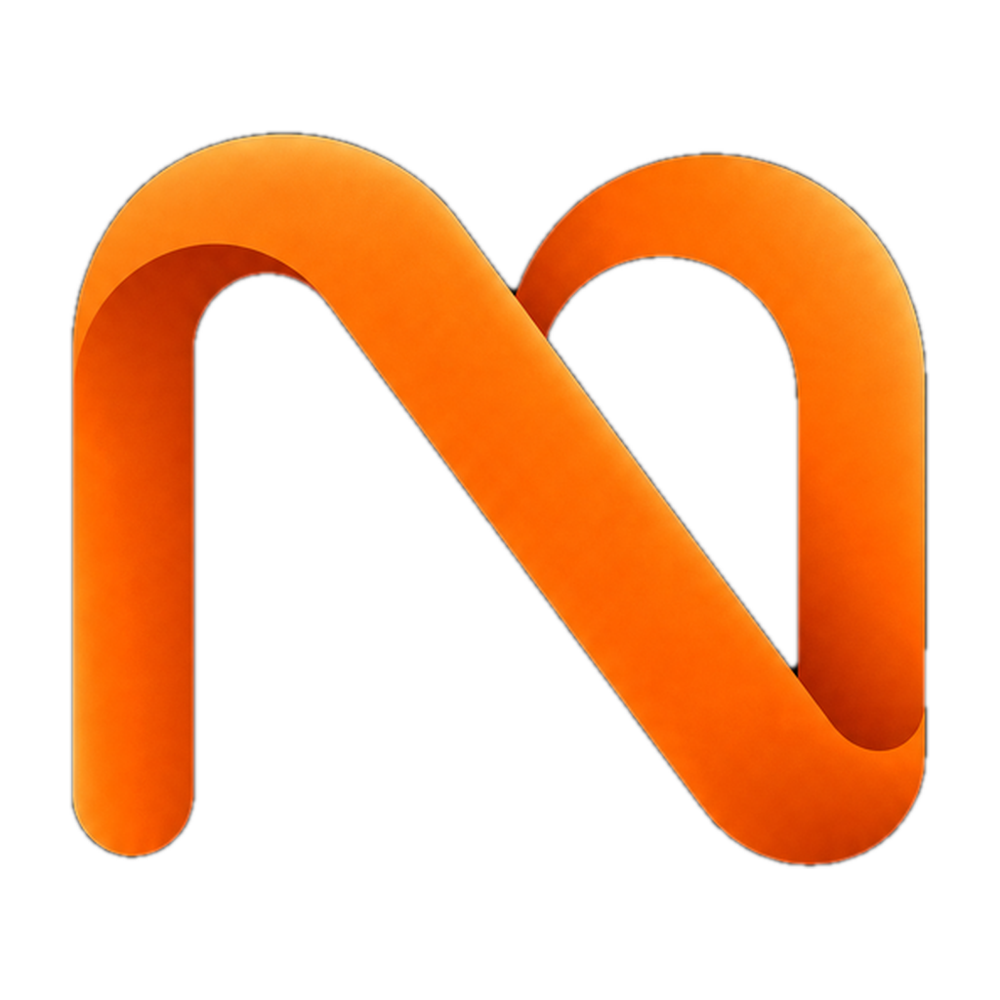
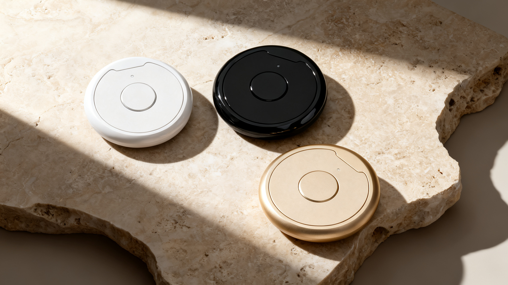

<p align="center">
  
</p>

<h1 align="center">Nexting</h1>

<p align="center">
  <strong>A wearable agent dispatcher for your own AI agents.</strong><br>
  Talk to your Claude Code, OpenClaw, or Codex anywhere, anytime — wear it, speak, dispatch. No phone, no app.
</p>

<p align="center">
  <a href="https://pinclaw.ai">Website</a> ·
  <a href="https://apps.apple.com/app/pinclaw/id6760344343">App Store</a> ·
  <a href="https://pinclaw.ai/doc">Docs</a> ·
  <a href="https://discord.gg/628R3FbV">Discord</a> ·
  <a href="https://x.com/EricShang98">Twitter</a>
</p>

<p align="center">
  <a href="LICENSE"></a>
  <a href="https://www.npmjs.com/package/pinclaw"></a>
</p>

---

<p align="center">
  
</p>

You already have powerful agents — Claude Code, OpenClaw, Codex. They're locked to your desk. **Nexting is the channel between you and them**: a terminal you wear, so you can reach your own agent without pulling out your phone or opening an app. Tap it, say one sentence, and the task is **dispatched to your own agent**. It runs in the background and the result comes back when it's done.

**Dispatch, not chat — press, speak, move on.**

Nexting comes in two form factors, one capability. The **PIN** ($129, shipping now) pins to your collar — the one you can get today. The **Ring** — our flagship, in private beta — makes "raise your hand and dispatch an agent" as invisible as a ring on your finger. Same capabilities, two shapes. Your whole agent team, always on you.

```
You speak → Nexting PIN (BLE) → iPhone App (STT) → Cloud → your own agent
                                                          (Claude Code / OpenClaw / Codex)
                                                               ↓
 Result pushed back ← iPhone App ← ── ── agent runs it in the background
```

**3 seconds to dispatch a task** — vs. ~30s pulling out your phone, unlocking, and typing.

## What Makes Nexting Different

| | |
|---|---|
| **Dispatch, not chat** | Fire-and-forget: say it once, your agent runs it in the background. Not Q&A. |
| **Your own agent** | Drives the agents you already run — Claude Code, OpenClaw, Codex. Not a locked-in model. |
| **Private by default** | BYOA modes (Claude Code, Codex, MyOpenClaw) are end-to-end encrypted — Nexting relays ciphertext, not your session. |
| **Delivers while you're offline** | Phone locked, on the move? The agent still finishes the job and pushes the result back. |
| **Remote-control Claude Code** | Attach to a Claude Code session on your Mac and drive it from your pocket — live. |
| **Deep iPhone integration** | Calendar, Reminders, Contacts, Health, HomeKit — all by voice. |

## How It Compares

Other AI wearables lock you into their own proprietary assistant. Nexting is the only one that **mobilizes the real agent tools you already use**.

| | Price | AI lock-in | Open source |
|---|---|---|---|
| Humane AI Pin | $499 + $24/mo | Single provider | No |
| Rabbit R1 | $199 | Rabbit OS only | No |
| Plaud NotePin | $169 | Plaud locked | No |
| **Nexting** | **PIN $129 · Ring in beta** | **Your own agents** | **Core (MIT)** |

Not another voice assistant — the pocket control surface for your agent team.

## Quick Start — OpenClaw Plugin

Nexting is the first hardware product built for [OpenClaw](https://github.com/openclaw/openclaw). Install the plugin, link your account, and your device dispatches tasks to your own AI agent.

> The npm package and CLI commands use the internal codename `pinclaw` — that's by design, not a leftover.

### 1. Install

```bash
openclaw plugins install pinclaw --dangerously-force-unsafe-install
```

### 2. Login

```bash
openclaw pinclaw login
```

Enter your pinclaw.ai email and password. The relay is configured and the gateway restarts automatically. You'll see `Relay connected!` when it's done.

### 3. Connect the app

Open the [Nexting iOS app](https://apps.apple.com/app/pinclaw/id6760344343), sign in with the same account — done.

### Verify

```
/pinclaw status
```

> See the full plugin documentation in [`plugin/README.md`](plugin/README.md) for configuration, API endpoints, server tools, and architecture details.

## Bring Your Own Agent

Nexting is a terminal, not a model. Connect the agent you already run:

| Mode | What It Is | Cost |
|------|-----------|------|
| **Claude Code** | Attach to a [Claude Code](https://claude.com/product/claude-code) session on your Mac and drive it from your PIN. | Free |
| **Codex** | Attach to an OpenAI Codex CLI session on your Mac and drive it from your PIN. | Free |
| **MyOpenClaw** | Run your own [OpenClaw](https://github.com/openclaw/openclaw) instance. We handle the relay. | Free |
| **MyHermes** | Any OpenAI-compatible local AI — Hermes Agent, Ollama, vLLM, LM Studio. No cloud required. | Free |
| **Nexting Pro** | Managed agent in the cloud. Latest Claude, GPT, and Gemini models, zero setup. | $29/mo or $279/yr |

Buy the hardware once. Dispatch to whichever agent is yours.

### MyHermes / Local AI Setup

Point Nexting at any OpenAI-compatible local AI with the `nexting-hermes-bridge` CLI:

```bash
# install the bridge
npm install -g nexting-hermes-bridge

# link your Nexting account
nexting-hermes-bridge login

# point it at your local AI and start
nexting-hermes-bridge start --endpoint http://localhost:8642 --model hermes-agent
```

## Hardware

Purpose-built for voice-first interaction. No screen — by design.

| Spec | Detail |
|------|--------|
| MCU | Seeed XIAO nRF52840 Sense (ARM Cortex-M4 @ 64MHz) |
| Microphone | PDM MEMS (built into XIAO Sense) |
| Audio | Opus codec over BLE 5.0, I2S speaker (MAX98357A) |
| Feedback | RGB LED + speaker (no screen) |
| Battery | 3.7V LiPo, USB-C charging (onboard BQ25101) |
| Firmware | Zephyr RTOS v2.2.0 ([source + UF2](hardware-opensource/firmware/pinclaw_zephyr/)) |
| Interaction | Single-button push-to-talk |

The [`hardware-opensource/`](hardware-opensource/) directory is a complete open-hardware **Co-Builder Edition**: firmware source, 3D-printable enclosure files, and a schematic PDF — everything you need to build a Nexting PIN yourself. Flash the UF2 binary via drag-and-drop — no programmer needed.

## iPhone Integration

Your phone isn't just a pipe — it's the bridge between you and your AI. The Nexting app registers native iOS capabilities as skills your agent can call:

- **Calendar** — Read and create events
- **Reminders** — Manage tasks and to-do lists
- **Contacts** — Look up people
- **Health** — Access HealthKit data
- **HomeKit** — Control smart home devices
- **Location** — Context-aware responses
- **Timer** — Set and manage timers

Say "schedule a meeting tomorrow at 3pm" — the agent calls your iPhone's calendar directly.

All data stays on your iPhone. You control every permission.

## Repository Structure

```
nexting/
├── hardware-opensource/       # Open-source DIY Co-Builder Kit
│   ├── firmware/              #   Zephyr firmware (source + UF2 binary)
│   ├── enclosure/             #   3D printing files (STL + OpenSCAD)
│   └── docs/                  #   Schematic PDF
├── plugin/                    # OpenClaw channel plugin (npm package)
└── public/                    # Product assets
```

> The codename `pinclaw` persists in package names, file paths, and identifiers — it's the permanent internal handle. **Nexting** is the brand. Both coexisting is intentional.

## Privacy

- BYOA modes (Claude Code, Codex, MyOpenClaw) are **end-to-end encrypted by default** — Nexting relays ciphertext, not readable session content
- Raw audio is discarded immediately after transcription — never stored
- Voice streams over encrypted WebSocket (WSS)
- Self-hosted modes keep all data on your own infrastructure
- No always-on listening — recording only while the button is held
- We never train on your data, never sell it, never share it — and you can delete it anytime

## Links

| | |
|---|---|
| Website | [pinclaw.ai](https://pinclaw.ai) |
| iOS App | [App Store](https://apps.apple.com/app/pinclaw/id6760344343) |
| Docs | [pinclaw.ai/doc](https://pinclaw.ai/doc) |
| Discord | [Join community](https://discord.gg/628R3FbV) |
| Twitter | [@EricShang98](https://x.com/EricShang98) |
| Get a PIN | [pinclaw.ai/reserve](https://pinclaw.ai/reserve) |

## Contributing

Nexting's core is open source (MIT) — hardware, firmware, cloud relay, and the OpenClaw plugin. Fork, build, and open a PR.

Join our [Discord](https://discord.gg/628R3FbV) to discuss ideas.

## License

MIT

---

<p align="center">
  <strong>Tap. Speak. Dispatch.</strong><br>
  <a href="https://pinclaw.ai/reserve">Get the PIN →</a>
</p>
